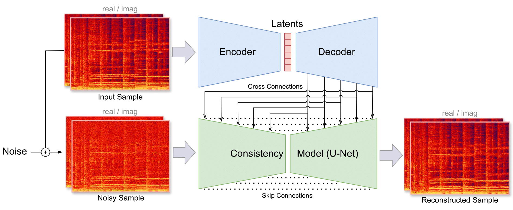

# Music2Latent: Consistency Autoencoders for Latent Audio Compression

**Abstract**  
Efficient audio waveform representations in a compressed continuous latent space are critical for generative audio modeling and Music Information Retrieval (MIR) tasks. However, some existing audio autoencoders have limitations, such as multi-stage training procedures, slow iterative sampling, or low reconstruction quality. We introduce Music2Latent, an audio autoencoder that overcomes these limitations by leveraging consistency models. Music2Latent encodes samples into a compressed continuous latent space in a single end-to-end training process while enabling high-fidelity single-step reconstruction. Key innovations include conditioning the consistency model on upsampled encoder outputs at all levels through cross connections, using frequency-wise self-attention to capture long-range frequency dependencies with fixed memory, and employing frequency-wise learned scaling to handle varying value distributions across frequencies at different noise levels. We demonstrate that Music2Latent outperforms existing continuous audio autoencoders in sound quality and reconstruction accuracy on standard metrics while achieving competitive performance on downstream MIR tasks using its latent representations. To our knowledge, this represents the first successful attempt at training an end-to-end consistency autoencoder model.

## Architecture
The input sample is first encoded into a sequence of latent vectors. The latents are then upsampled with a decoder model. The consistency model is trained via consistency training, with an additional information leakage coming from the cross connections.

## Audio Examples

We compare the reconstructions of Music2Latent against baselines for MusicCaps evaluation samples.

| Real Sample | **Music2Latent** | Musika | LatMusic | Mousaiv2 | Mousaiv3 | --- | DAC |
| ----------- | ----------------- | ------ | -------- | -------- | -------- | --- | --- |
| [-0SdAVK79lg.mp3](real/-0SdAVK79lg.mp3) | [-0SdAVK79lg.mp3](music2latent/-0SdAVK79lg.mp3) | [-0SdAVK79lg.mp3](musika/-0SdAVK79lg.mp3) | [-0SdAVK79lg.mp3](latmusic/-0SdAVK79lg.mp3) | [-0SdAVK79lg.mp3](mousaiv2/-0SdAVK79lg.mp3) | [-0SdAVK79lg.mp3](mousaiv3/-0SdAVK79lg.mp3) | --- | [-0SdAVK79lg.mp3](dac/-0SdAVK79lg.mp3) |
| [-0vPFx-wRRI.mp3](real/-0vPFx-wRRI.mp3) | [-0vPFx-wRRI.mp3](music2latent/-0vPFx-wRRI.mp3) | [-0vPFx-wRRI.mp3](musika/-0vPFx-wRRI.mp3) | [-0vPFx-wRRI.mp3](latmusic/-0vPFx-wRRI.mp3) | [-0vPFx-wRRI.mp3](mousaiv2/-0vPFx-wRRI.mp3) | [-0vPFx-wRRI.mp3](mousaiv3/-0vPFx-wRRI.mp3) | --- | [-0vPFx-wRRI.mp3](dac/-0vPFx-wRRI.mp3) |
| [-1OlgJWehn8.mp3](real/-1OlgJWehn8.mp3) | [-1OlgJWehn8.mp3](music2latent/-1OlgJWehn8.mp3) | [-1OlgJWehn8.mp3](musika/-1OlgJWehn8.mp3) | [-1OlgJWehn8.mp3](latmusic/-1OlgJWehn8.mp3) | [-1OlgJWehn8.mp3](mousaiv2/-1OlgJWehn8.mp3) | [-1OlgJWehn8.mp3](mousaiv3/-1OlgJWehn8.mp3) | --- | [-1OlgJWehn8.mp3](dac/-1OlgJWehn8.mp3) |
| [-4NLarMj4xU.mp3](real/-4NLarMj4xU.mp3) | [-4NLarMj4xU.mp3](music2latent/-4NLarMj4xU.mp3) | [-4NLarMj4xU.mp3](musika/-4NLarMj4xU.mp3) | [-4NLarMj4xU.mp3](latmusic/-4NLarMj4xU.mp3) | [-4NLarMj4xU.mp3](mousaiv2/-4NLarMj4xU.mp3) | [-4NLarMj4xU.mp3](mousaiv3/-4NLarMj4xU.mp3) | --- | [-4NLarMj4xU.mp3](dac/-4NLarMj4xU.mp3) |
| [-5xOcMJpTUk.mp3](real/-5xOcMJpTUk.mp3) | [-5xOcMJpTUk.mp3](music2latent/-5xOcMJpTUk.mp3) | [-5xOcMJpTUk.mp3](musika/-5xOcMJpTUk.mp3) | [-5xOcMJpTUk.mp3](latmusic/-5xOcMJpTUk.mp3) | [-5xOcMJpTUk.mp3](mousaiv2/-5xOcMJpTUk.mp3) | [-5xOcMJpTUk.mp3](mousaiv3/-5xOcMJpTUk.mp3) | --- | [-5xOcMJpTUk.mp3](dac/-5xOcMJpTUk.mp3) |
| [-7wUQP6G5EQ.mp3](real/-7wUQP6G5EQ.mp3) | [-7wUQP6G5EQ.mp3](music2latent/-7wUQP6G5EQ.mp3) | [-7wUQP6G5EQ.mp3](musika/-7wUQP6G5EQ.mp3) | [-7wUQP6G5EQ.mp3](latmusic/-7wUQP6G5EQ.mp3) | [-7wUQP6G5EQ.mp3](mousaiv2/-7wUQP6G5EQ.mp3) | [-7wUQP6G5EQ.mp3](mousaiv3/-7wUQP6G5EQ.mp3) | --- | [-7wUQP6G5EQ.mp3](dac/-7wUQP6G5EQ.mp3) |
| [-8cgbhIR_pw.mp3](real/-8cgbhIR_pw.mp3) | [-8cgbhIR_pw.mp3](music2latent/-8cgbhIR_pw.mp3) | [-8cgbhIR_pw.mp3](musika/-8cgbhIR_pw.mp3) | [-8cgbhIR_pw.mp3](latmusic/-8cgbhIR_pw.mp3) | [-8cgbhIR_pw.mp3](mousaiv2/-8cgbhIR_pw.mp3) | [-8cgbhIR_pw.mp3](mousaiv3/-8cgbhIR_pw.mp3) | --- | [-8cgbhIR_pw.mp3](dac/-8cgbhIR_pw.mp3) |
| [-Bu7YaslRW0.mp3](real/-Bu7YaslRW0.mp3) | [-Bu7YaslRW0.mp3](music2latent/-Bu7YaslRW0.mp3) | [-Bu7YaslRW0.mp3](musika/-Bu7YaslRW0.mp3) | [-Bu7YaslRW0.mp3](latmusic/-Bu7YaslRW0.mp3) | [-Bu7YaslRW0.mp3](mousaiv2/-Bu7YaslRW0.mp3) | [-Bu7YaslRW0.mp3](mousaiv3/-Bu7YaslRW0.mp3) | --- | [-Bu7YaslRW0.mp3](dac/-Bu7YaslRW0.mp3) |
| [-ByoSbgzr4M.mp3](real/-ByoSbgzr4M.mp3) | [-ByoSbgzr4M.mp3](music2latent/-ByoSbgzr4M.mp3) | [-ByoSbgzr4M.mp3](musika/-ByoSbgzr4M.mp3) | [-ByoSbgzr4M.mp3](latmusic/-ByoSbgzr4M.mp3) | [-ByoSbgzr4M.mp3](mousaiv2/-ByoSbgzr4M.mp3) | [-ByoSbgzr4M.mp3](mousaiv3/-ByoSbgzr4M.mp3) | --- | [-ByoSbgzr4M.mp3](dac/-ByoSbgzr4M.mp3) |
| [-CUp_Tmg2Y0.mp3](real/-CUp_Tmg2Y0.mp3) | [-CUp_Tmg2Y0.mp3](music2latent/-CUp_Tmg2Y0.mp3) | [-CUp_Tmg2Y0.mp3](musika/-CUp_Tmg2Y0.mp3) | [-CUp_Tmg2Y0.mp3](latmusic/-CUp_Tmg2Y0.mp3) | [-CUp_Tmg2Y0.mp3](mousaiv2/-CUp_Tmg2Y0.mp3) | [-CUp_Tmg2Y0.mp3](mousaiv3/-CUp_Tmg2Y0.mp3) | --- | [-CUp_Tmg2Y0.mp3](dac/-CUp_Tmg2Y0.mp3) |
| [-DeAdhYKbGE.mp3](real/-DeAdhYKbGE.mp3) | [-DeAdhYKbGE.mp3](music2latent/-DeAdhYKbGE.mp3) | [-DeAdhYKbGE.mp3](musika/-DeAdhYKbGE.mp3) | [-DeAdhYKbGE.mp3](latmusic/-DeAdhYKbGE.mp3) | [-DeAdhYKbGE.mp3](mousaiv2/-DeAdhYKbGE.mp3) | [-DeAdhYKbGE.mp3](mousaiv3/-DeAdhYKbGE.mp3) | --- | [-DeAdhYKbGE.mp3](dac/-DeAdhYKbGE.mp3) |
| [-Dtir74TiUM.mp3](real/-Dtir74TiUM.mp3) | [-Dtir74TiUM.mp3](music2latent/-Dtir74TiUM.mp3) | [-Dtir74TiUM.mp3](musika/-Dtir74TiUM.mp3) | [-Dtir74TiUM.mp3](latmusic/-Dtir74TiUM.mp3) | [-Dtir74TiUM.mp3](mousaiv2/-Dtir74TiUM.mp3) | [-Dtir74TiUM.mp3](mousaiv3/-Dtir74TiUM.mp3) | --- | [-Dtir74TiUM.mp3](dac/-Dtir74TiUM.mp3) |
| [-FEPOSP7ay0.mp3](real/-FEPOSP7ay0.mp3) | [-FEPOSP7ay0.mp3](music2latent/-FEPOSP7ay0.mp3) | [-FEPOSP7ay0.mp3](musika/-FEPOSP7ay0.mp3) | [-FEPOSP7ay0.mp3](latmusic/-FEPOSP7ay0.mp3) | [-FEPOSP7ay0.mp3](mousaiv2/-FEPOSP7ay0.mp3) | [-FEPOSP7ay0.mp3](mousaiv3/-FEPOSP7ay0.mp3) | --- | [-FEPOSP7ay0.mp3](dac/-FEPOSP7ay0.mp3) |
| [-FFx68qSAuY.mp3](real/-FFx68qSAuY.mp3) | [-FFx68qSAuY.mp3](music2latent/-FFx68qSAuY.mp3) | [-FFx68qSAuY.mp3](musika/-FFx68qSAuY.mp3) | [-FFx68qSAuY.mp3](latmusic/-FFx68qSAuY.mp3) | [-FFx68qSAuY.mp3](mousaiv2/-FFx68qSAuY.mp3) | [-FFx68qSAuY.mp3](mousaiv3/-FFx68qSAuY.mp3) | --- | [-FFx68qSAuY.mp3](dac/-FFx68qSAuY.mp3) |
| [-FlvaZQOr2I.mp3](real/-FlvaZQOr2I.mp3) | [-FlvaZQOr2I.mp3](music2latent/-FlvaZQOr2I.mp3) | [-FlvaZQOr2I.mp3](musika/-FlvaZQOr2I.mp3) | [-FlvaZQOr2I.mp3](latmusic/-FlvaZQOr2I.mp3) | [-FlvaZQOr2I.mp3](mousaiv2/-FlvaZQOr2I.mp3) | [-FlvaZQOr2I.mp3](mousaiv3/-FlvaZQOr2I.mp3) | --- | [-FlvaZQOr2I.mp3](dac/-FlvaZQOr2I.mp3) |
| [-Gf4Ihv1zwc.mp3](real/-Gf4Ihv1zwc.mp3) | [-Gf4Ihv1zwc.mp3](music2latent/-Gf4Ihv1zwc.mp3) | [-Gf4Ihv1zwc.mp3](musika/-Gf4Ihv1zwc.mp3) | [-Gf4Ihv1zwc.mp3](latmusic/-Gf4Ihv1zwc.mp3) | [-Gf4Ihv1zwc.mp3](mousaiv2/-Gf4Ihv1zwc.mp3) | [-Gf4Ihv1zwc.mp3](mousaiv3/-Gf4Ihv1zwc.mp3) | --- | [-Gf4Ihv1zwc.mp3](dac/-Gf4Ihv1zwc.mp3) |
| [-O9mnfC61Ac.mp3](real/-O9mnfC61Ac.mp3) | [-O9mnfC61Ac.mp3](music2latent/-O9mnfC61Ac.mp3) | [-O9mnfC61Ac.mp3](musika/-O9mnfC61Ac.mp3) | [-O9mnfC61Ac.mp3](latmusic/-O9mnfC61Ac.mp3) | [-O9mnfC61Ac.mp3](mousaiv2/-O9mnfC61Ac.mp3) | [-O9mnfC61Ac.mp3](mousaiv3/-O9mnfC61Ac.mp3) | --- | [-O9mnfC61Ac.mp3](dac/-O9mnfC61Ac.mp3) |
| [-OAyRsvFGgc.mp3](real/-OAyRsvFGgc.mp3) | [-OAyRsvFGgc.mp3](music2latent/-OAyRsvFGgc.mp3) | [-OAyRsvFGgc.mp3](musika/-OAyRsvFGgc.mp3) | [-OAyRsvFGgc.mp3](latmusic/-OAyRsvFGgc.mp3) | [-OAyRsvFGgc.mp3](mousaiv2/-OAyRsvFGgc.mp3) | [-OAyRsvFGgc.mp3](mousaiv3/-OAyRsvFGgc.mp3) | --- | [-OAyRsvFGgc.mp3](dac/-OAyRsvFGgc.mp3) |
| [-OUIEnuNd1I.mp3](real/-OUIEnuNd1I.mp3) | [-OUIEnuNd1I.mp3](music2latent/-OUIEnuNd1I.mp3) | [-OUIEnuNd1I.mp3](musika/-OUIEnuNd1I.mp3) | [-OUIEnuNd1I.mp3](latmusic/-OUIEnuNd1I.mp3) | [-OUIEnuNd1I.mp3](mousaiv2/-OUIEnuNd1I.mp3) | [-OUIEnuNd1I.mp3](mousaiv3/-OUIEnuNd1I.mp3) | --- | [-OUIEnuNd1I.mp3](dac/-OUIEnuNd1I.mp3) |
| [-Q9MTRXS4bE.mp3](real/-Q9MTRXS4bE.mp3) | [-Q9MTRXS4bE.mp3](music2latent/-Q9MTRXS4bE.mp3) | [-Q9MTRXS4bE.mp3](musika/-Q9MTRXS4bE.mp3) | [-Q9MTRXS4bE.mp3](latmusic/-Q9MTRXS4bE.mp3) | [-Q9MTRXS4bE.mp3](mousaiv2/-Q9MTRXS4bE.mp3) | [-Q9MTRXS4bE.mp3](mousaiv3/-Q9MTRXS4bE.mp3) | --- | [-Q9MTRXS4bE.mp3](dac/-Q9MTRXS4bE.mp3) |
| [-QuWdnmn-kM.mp3](real/-QuWdnmn-kM.mp3) | [-QuWdnmn-kM.mp3](music2latent/-QuWdnmn-kM.mp3) | [-QuWdnmn-kM.mp3](musika/-QuWdnmn-kM.mp3) | [-QuWdnmn-kM.mp3](latmusic/-QuWdnmn-kM.mp3) | [-QuWdnmn-kM.mp3](mousaiv2/-QuWdnmn-kM.mp3) | [-QuWdnmn-kM.mp3](mousaiv3/-QuWdnmn-kM.mp3) | --- | [-QuWdnmn-kM.mp3](dac/-QuWdnmn-kM.mp3) |
| [-R0267o4lLk.mp3](real/-R0267o4lLk.mp3) | [-R0267o4lLk.mp3](music2latent/-R0267o4lLk.mp3) | [-R0267o4lLk.mp3](musika/-R0267o4lLk.mp3) | [-R0267o4lLk.mp3](latmusic/-R0267o4lLk.mp3) | [-R0267o4lLk.mp3](mousaiv2/-R0267o4lLk.mp3) | [-R0267o4lLk.mp3](mousaiv3/-R0267o4lLk.mp3) | --- | [-R0267o4lLk.mp3](dac/-R0267o4lLk.mp3) |
| [-SD43H5B5hE.mp3](real/-SD43H5B5hE.mp3) | [-SD43H5B5hE.mp3](music2latent/-SD43H5B5hE.mp3) | [-SD43H5B5hE.mp3](musika/-SD43H5B5hE.mp3) | [-SD43H5B5hE.mp3](latmusic/-SD43H5B5hE.mp3) | [-SD43H5B5hE.mp3](mousaiv2/-SD43H5B5hE.mp3) | [-SD43H5B5hE.mp3](mousaiv3/-SD43H5B5hE.mp3) | --- | [-SD43H5B5hE.mp3](dac/-SD43H5B5hE.mp3) |
| [-W5c6CeUMPE.mp3](real/-W5c6CeUMPE.mp3) | [-W5c6CeUMPE.mp3](music2latent/-W5c6CeUMPE.mp3) | [-W5c6CeUMPE.mp3](musika/-W5c6CeUMPE.mp3) | [-W5c6CeUMPE.mp3](latmusic/-W5c6CeUMPE.mp3) | [-W5c6CeUMPE.mp3](mousaiv2/-W5c6CeUMPE.mp3) | [-W5c6CeUMPE.mp3](mousaiv3/-W5c6CeUMPE.mp3) | --- | [-W5c6CeUMPE.mp3](dac/-W5c6CeUMPE.mp3) |
| [-XN0NtrnfMY.mp3](real/-XN0NtrnfMY.mp3) | [-XN0NtrnfMY.mp3](music2latent/-XN0NtrnfMY.mp3) | [-XN0NtrnfMY.mp3](musika/-XN0NtrnfMY.mp3) | [-XN0NtrnfMY.mp3](latmusic/-XN0NtrnfMY.mp3) | [-XN0NtrnfMY.mp3](mousaiv2/-XN0NtrnfMY.mp3) | [-XN0NtrnfMY.mp3](mousaiv3/-XN0NtrnfMY.mp3) | --- | [-XN0NtrnfMY.mp3](dac/-XN0NtrnfMY.mp3) |
| [-YATTKBtmRA.mp3](real/-YATTKBtmRA.mp3) | [-YATTKBtmRA.mp3](music2latent/-YATTKBtmRA.mp3) | [-YATTKBtmRA.mp3](musika/-YATTKBtmRA.mp3) | [-YATTKBtmRA.mp3](latmusic/-YATTKBtmRA.mp3) | [-YATTKBtmRA.mp3](mousaiv2/-YATTKBtmRA.mp3) | [-YATTKBtmRA.mp3](mousaiv3/-YATTKBtmRA.mp3) | --- | [-YATTKBtmRA.mp3](dac/-YATTKBtmRA.mp3) |
| [-_OzT7Xyvok.mp3](real/-_OzT7Xyvok.mp3) | [-_OzT7Xyvok.mp3](music2latent/-_OzT7Xyvok.mp3) | [-_OzT7Xyvok.mp3](musika/-_OzT7Xyvok.mp3) | [-_OzT7Xyvok.mp3](latmusic/-_OzT7Xyvok.mp3) | [-_OzT7Xyvok.mp3](mousaiv2/-_OzT7Xyvok.mp3) | [-_OzT7Xyvok.mp3](mousaiv3/-_OzT7Xyvok.mp3) | --- | [-_OzT7Xyvok.mp3](dac/-_OzT7Xyvok.mp3) |
| [-cLzki-B06o.mp3](real/-cLzki-B06o.mp3) | [-cLzki-B06o.mp3](music2latent/-cLzki-B06o.mp3) | [-cLzki-B06o.mp3](musika/-cLzki-B06o.mp3) | [-cLzki-B06o.mp3](latmusic/-cLzki-B06o.mp3) | [-cLzki-B06o.mp3](mousaiv2/-cLzki-B06o.mp3) | [-cLzki-B06o.mp3](mousaiv3/-cLzki-B06o.mp3) | --- | [-cLzki-B06o.mp3](dac/-cLzki-B06o.mp3) |
| [-cQ-jUTEgck.mp3](real/-cQ-jUTEgck.mp3) | [-cQ-jUTEgck.mp3](music2latent/-cQ-jUTEgck.mp3) | [-cQ-jUTEgck.mp3](musika/-cQ-jUTEgck.mp3) | [-cQ-jUTEgck.mp3](latmusic/-cQ-jUTEgck.mp3) | [-cQ-jUTEgck.mp3](mousaiv2/-cQ-jUTEgck.mp3) | [-cQ-jUTEgck.mp3](mousaiv3/-cQ-jUTEgck.mp3) | --- | [-cQ-jUTEgck.mp3](dac/-cQ-jUTEgck.mp3) |
| [-eDAoheZrY8.mp3](real/-eDAoheZrY8.mp3) | [-eDAoheZrY8.mp3](music2latent/-eDAoheZrY8.mp3) | [-eDAoheZrY8.mp3](musika/-eDAoheZrY8.mp3) | [-eDAoheZrY8.mp3](latmusic/-eDAoheZrY8.mp3) | [-eDAoheZrY8.mp3](mousaiv2/-eDAoheZrY8.mp3) | [-eDAoheZrY8.mp3](mousaiv3/-eDAoheZrY8.mp3) | --- | [-eDAoheZrY8.mp3](dac/-eDAoheZrY8.mp3) |
| [-f1DNyngKVY.mp3](real/-f1DNyngKVY.mp3) | [-f1DNyngKVY.mp3](music2latent/-f1DNyngKVY.mp3) | [-f1DNyngKVY.mp3](musika/-f1DNyngKVY.mp3) | [-f1DNyngKVY.mp3](latmusic/-f1DNyngKVY.mp3) | [-f1DNyngKVY.mp3](mousaiv2/-f1DNyngKVY.mp3) | [-f1DNyngKVY.mp3](mousaiv3/-f1DNyngKVY.mp3) | --- | [-f1DNyngKVY.mp3](dac/-f1DNyngKVY.mp3) |
| [-i9gpG3vPwA.mp3](real/-i9gpG3vPwA.mp3) | [-i9gpG3vPwA.mp3](music2latent/-i9gpG3vPwA.mp3) | [-i9gpG3vPwA.mp3](musika/-i9gpG3vPwA.mp3) | [-i9gpG3vPwA.mp3](latmusic/-i9gpG3vPwA.mp3) | [-i9gpG3vPwA.mp3](mousaiv2/-i9gpG3vPwA.mp3) | [-i9gpG3vPwA.mp3](mousaiv3/-i9gpG3vPwA.mp3) | --- | [-i9gpG3vPwA.mp3](dac/-i9gpG3vPwA.mp3) |
| [-i9uQMysy_A.mp3](real/-i9uQMysy_A.mp3) | [-i9uQMysy_A.mp3](music2latent/-i9uQMysy_A.mp3) | [-i9uQMysy_A.mp3](musika/-i9uQMysy_A.mp3) | [-i9uQMysy_A.mp3](latmusic/-i9uQMysy_A.mp3) | [-i9uQMysy_A.mp3](mousaiv2/-i9uQMysy_A.mp3) | [-i9uQMysy_A.mp3](mousaiv3/-i9uQMysy_A.mp3) | --- | [-i9uQMysy_A.mp3](dac/-i9uQMysy_A.mp3) |
| [-jpbCWcz2pk.mp3](real/-jpbCWcz2pk.mp3) | [-jpbCWcz2pk.mp3](music2latent/-jpbCWcz2pk.mp3) | [-jpbCWcz2pk.mp3](musika/-jpbCWcz2pk.mp3) | [-jpbCWcz2pk.mp3](latmusic/-jpbCWcz2pk.mp3) | [-jpbCWcz2pk.mp3](mousaiv2/-jpbCWcz2pk.mp3) | [-jpbCWcz2pk.mp3](mousaiv3/-jpbCWcz2pk.mp3) | --- | [-jpbCWcz2pk.mp3](dac/-jpbCWcz2pk.mp3) |
| [-m5ZlWziIeA.mp3](real/-m5ZlWziIeA.mp3) | [-m5ZlWziIeA.mp3](music2latent/-m5ZlWziIeA.mp3) | [-m5ZlWziIeA.mp3](musika/-m5ZlWziIeA.mp3) | [-m5ZlWziIeA.mp3](latmusic/-m5ZlWziIeA.mp3) | [-m5ZlWziIeA.mp3](mousaiv2/-m5ZlWziIeA.mp3) | [-m5ZlWziIeA.mp3](mousaiv3/-m5ZlWziIeA.mp3) | --- | [-m5ZlWziIeA.mp3](dac/-m5ZlWziIeA.mp3) |
| [-nlkWWphiaM.mp3](real/-nlkWWphiaM.mp3) | [-nlkWWphiaM.mp3](music2latent/-nlkWWphiaM.mp3) | [-nlkWWphiaM.mp3](musika/-nlkWWphiaM.mp3) | [-nlkWWphiaM.mp3](latmusic/-nlkWWphiaM.mp3) | [-nlkWWphiaM.mp3](mousaiv2/-nlkWWphiaM.mp3) | [-nlkWWphiaM.mp3](mousaiv3/-nlkWWphiaM.mp3) | --- | [-nlkWWphiaM.mp3](dac/-nlkWWphiaM.mp3) |
| [-r7iz-9v9bA.mp3](real/-r7iz-9v9bA.mp3) | [-r7iz-9v9bA.mp3](music2latent/-r7iz-9v9bA.mp3) | [-r7iz-9v9bA.mp3](musika/-r7iz-9v9bA.mp3) | [-r7iz-9v9bA.mp3](latmusic/-r7iz-9v9bA.mp3) | [-r7iz-9v9bA.mp3](mousaiv2/-r7iz-9v9bA.mp3) | [-r7iz-9v9bA.mp3](mousaiv3/-r7iz-9v9bA.mp3) | --- | [-r7iz-9v9bA.mp3](dac/-r7iz-9v9bA.mp3) |
| [-tKZOl4q1Kw.mp3](real/-tKZOl4q1Kw.mp3) | [-tKZOl4q1Kw.mp3](music2latent/-tKZOl4q1Kw.mp3) | [-tKZOl4q1Kw.mp3](musika/-tKZOl4q1Kw.mp3) | [-tKZOl4q1Kw.mp3](latmusic/-tKZOl4q1Kw.mp3) | [-tKZOl4q1Kw.mp3](mousaiv2/-tKZOl4q1Kw.mp3) | [-tKZOl4q1Kw.mp3](mousaiv3/-tKZOl4q1Kw.mp3) | --- | [-tKZOl4q1Kw.mp3](dac/-tKZOl4q1Kw.mp3) |

<!-- We finally present some audio samples of separations produced by the system. By cross-referencing the cluster index with the histogram shown above, it is possible to recognize the class of sources characteristic of each cluster. -->

<!-- ### Example 0

Mix
<audio src="audio/4/mix.wav" controls ></audio>
Cluster 3 (Drums)
<audio src="audio/4/3.wav" controls ></audio>
Cluster 5 (Drums)
<audio src="audio/4/5.wav" controls ></audio>
Cluster 6 (Bass/Toms)
<audio src="audio/4/6.wav" controls ></audio>
Cluster 12 (Crash)
<audio src="audio/4/12.wav" controls ></audio>
Cluster 14 (Vocals)
<audio src="audio/4/14.wav" controls ></audio>

### Example 1

Mix
<audio src="audio/5/mix.wav" controls ></audio>
Cluster 3 (Drums)
<audio src="audio/5/3.wav" controls ></audio>
Cluster 5 (Drums)
<audio src="audio/5/5.wav" controls ></audio>
Cluster 6 (Bass/Toms)
<audio src="audio/5/6.wav" controls ></audio>
Cluster 8 (Guitar)
<audio src="audio/5/8.wav" controls ></audio>

### Example 2

Mix
<audio src="audio/3/mix.wav" controls ></audio>
Cluster 3 (Drums)
<audio src="audio/3/3.wav" controls ></audio>
Cluster 5 (Drums)
<audio src="audio/3/5.wav" controls ></audio>
Cluster 10 (Misc)
<audio src="audio/3/10.wav" controls ></audio>
Cluster 14 (Vocals)
<audio src="audio/3/14.wav" controls ></audio>

### Example 3

Mix
<audio src="audio/6/mix.wav" controls ></audio>
Cluster 3 (Drums)
<audio src="audio/6/3.wav" controls ></audio>
Cluster 5 (Drums)
<audio src="audio/6/5.wav" controls ></audio>
Cluster 6 (Bass/Toms)
<audio src="audio/6/6.wav" controls ></audio>
Cluster 12 (Crash)
<audio src="audio/6/12.wav" controls ></audio>
Cluster 14 (Vocals)
<audio src="audio/6/14.wav" controls ></audio>

### Example 4

Mix
<audio src="audio/0/mix.wav" controls ></audio>
Cluster 6 (Bass/Toms)
<audio src="audio/0/6.wav" controls ></audio>
Cluster 8 (Guitar)
<audio src="audio/0/8.wav" controls ></audio>
Cluster 14 (Vocals)
<audio src="audio/0/14.wav" controls ></audio>

### Example 5

Mix
<audio src="audio/1/mix.wav" controls ></audio>
Cluster 3 (Drums)
<audio src="audio/1/3.wav" controls ></audio>
Cluster 5 (Drums)
<audio src="audio/1/5.wav" controls ></audio>
Cluster 8 (Guitar)
<audio src="audio/1/8.wav" controls ></audio>
Cluster 12 (Crash)
<audio src="audio/1/12.wav" controls ></audio>
Cluster 14 (Vocals)
<audio src="audio/1/14.wav" controls ></audio>

 -->

 <!-- ## Mel-Spectrograms of Reconstructions

We show mel-spectrograms of example input mixes and separated outputs. For each separation from 0 to 15 the Generator is conditioned on the corresponding quantized embedding. By cross-referencing this visualization with the clustering histogram shown below, it is possible to recognize specific sources.

   -->
